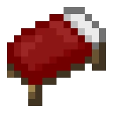

# Welcome
Hi, I'm toydotgame.

I'm currently developer and maintainer of a few Spigot plugins. I know Java; I'm learning C#; and I've done small amounts of static web-dev. [Find out a bit more about what I've done here.](about.html)

## Projects
### [Thisway](https://spigotmc.org/resources/thisway.87115/)
 Thisway is a Spigot plugin for 1.6 and up which enables a bit of a simpler teleportation system for going in a certain direction.

 

### [SinglePlayerSleep](https://www.spigotmc.org/resources/singleplayersleep.91195/) & [SleepMessage](https://www.spigotmc.org/resources/sleepmessage.91191/)
 SinglePlayerSleep is a visual copy of Hermitcraft's singple player sleep plugin. It allows a player to skip the world's time to day when only they are sleeping in a Bed, rather than needing everyone online to be in a Bed.

SleepMessage is a visual copy of Legacy Console Edition Minecraft's chat messages when someone gets into a Bed.

## Tutorials
* [How to Create an Instant-Launch Shortcut for Minecraft](tutorials/instantMinecraft.html)

## Active Accounts
* [GitHub](https://github.com/toydotgame)
* [Twitter](https://github.com/toydotgame)
* [YouTube](https://www.youtube.com/channel/UCgkC2xFIPZCLEadyYZCsbWw)
* [SpigotMC](https://www.spigotmc.org/members/toydotgam.1096646/)
* [Minecraft Forum](https://www.minecraftforum.net/members/toydotgam)
